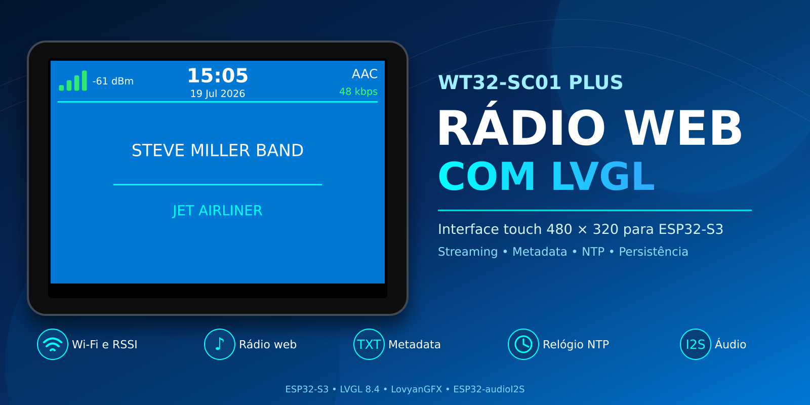
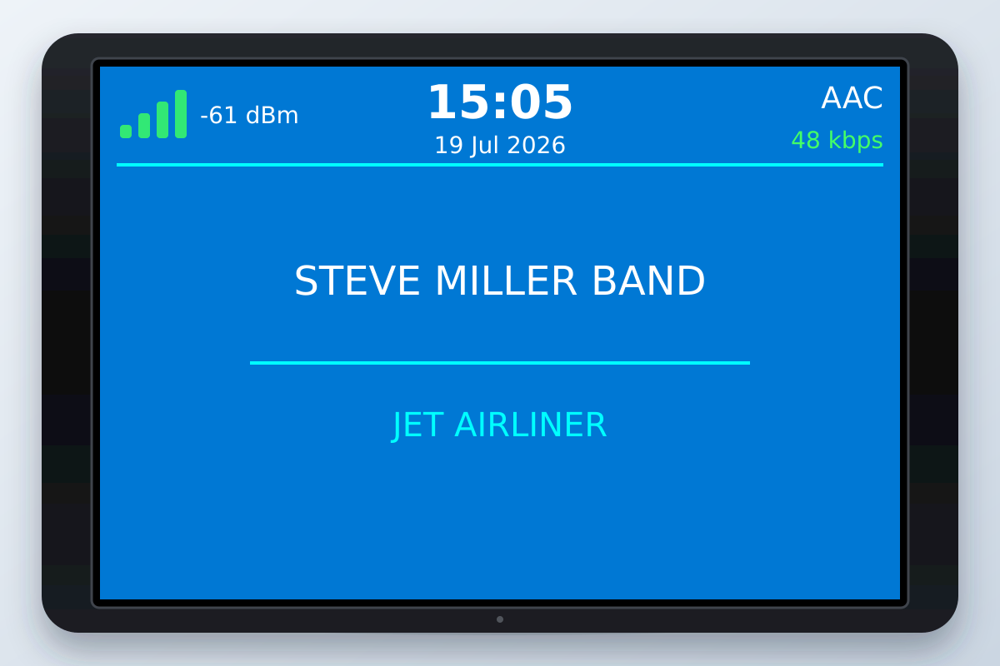
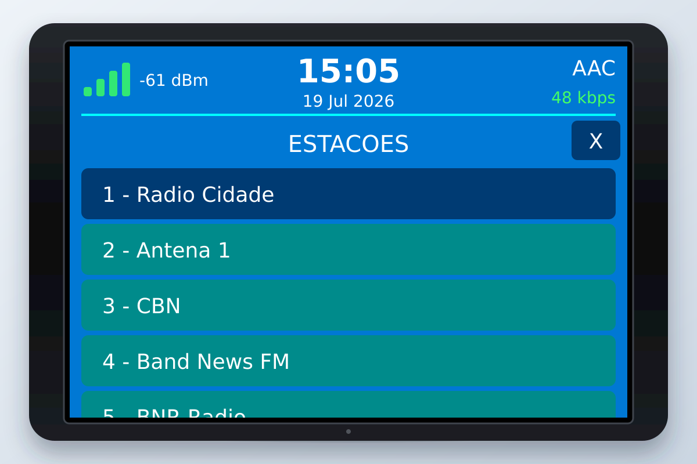
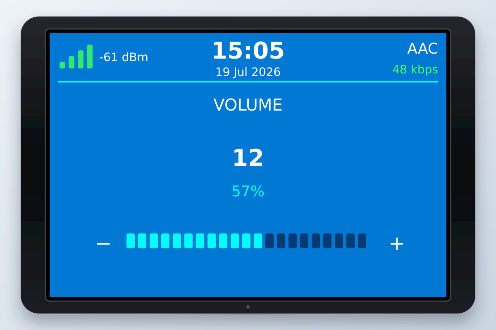

# Rádio Web LVGL para WT32-SC01 Plus

Rádio web para a placa **WT32-SC01 Plus**, baseada no ESP32-S3 e equipada com display touch de 480 × 320 pixels.

O projeto utiliza **LVGL** para a interface, **LovyanGFX** para controlar o display e o touch, e **ESP32-audioI2S** para reproduzir streams de rádio pela saída I2S.



## Recursos

- Reprodução de rádios web em MP3, AAC e outros formatos suportados pela ESP32-audioI2S.
- Áudio executado em uma tarefa dedicada no core 0.
- Interface gráfica construída com LVGL 8.4.
- Conexão Wi-Fi sem bloquear a inicialização da interface.
- Reconexão do stream após o retorno do Wi-Fi.
- Nova tentativa automática de conexão a cada 8 segundos.
- Comando Stop respeitado durante as tentativas automáticas.
- Play e Stop por toque no centro da tela.
- Lista rolável de estações.
- Controle de volume por gesto horizontal, sem slider.
- Painel de volume fechado automaticamente após 3 segundos.
- Persistência da última estação e do volume na memória do ESP32.
- RSSI do Wi-Fi em barras e em dBm.
- Relógio e data sincronizados por NTP.
- Exibição de codec e bitrate.
- Exibição de artista e música com rolagem circular para textos longos.

## Interface

### Tela principal



A parte superior mostra:

- intensidade do sinal Wi-Fi;
- horário e data;
- codec do áudio;
- bitrate do stream.

No centro são mostrados o artista e o título da música. Um toque na região central alterna entre Play e Stop.

### Lista de estações



Para abrir a lista, deslize o dedo de cima para baixo começando no cabeçalho. Toque em uma estação para selecioná-la. A estação escolhida começa a tocar e fica salva para a próxima inicialização.

A lista pode ser fechada pelo botão `X` ou com um gesto para cima.

### Controle de volume



Para abrir o painel, deslize o dedo da esquerda para a direita começando próximo à borda esquerda da tela.

Com o painel aberto:

- mova o dedo para a direita para aumentar o volume;
- mova o dedo para a esquerda para diminuir o volume;
- o valor varia de `0` a `21`;
- o painel fecha automaticamente 3 segundos após a última interação;
- não existe botão de fechar, pois o fechamento é automático.

O volume selecionado também fica salvo para a próxima inicialização.

## Hardware

- WT32-SC01 Plus com ESP32-S3.
- Display touch 480 × 320.
- Controlador de display ST7796U.
- Controlador touch FT5x06.
- DAC ou amplificador com entrada I2S, como o MAX98357A.
- https://pt.aliexpress.com/item/1005006198835803.html.

### Pinos de áudio I2S

| Sinal | GPIO |
| --- | ---: |
| `DOUT` | 37 |
| `BCLK` | 36 |
| `LRC` | 35 |

Os pinos podem ser alterados em `config.h`.

## Dependências

Versões utilizadas durante o desenvolvimento:

- ESP32 Arduino Core 3.3.4.
- LVGL 8.4.0.
- LovyanGFX 1.2.24.
- ESP32-audioI2S 3.0.12.

O código foi desenvolvido para a API do **LVGL 8**. O LVGL 9 possui diferenças de API e não deve ser utilizado sem adaptar o projeto.

## Configuração do LVGL

Crie o arquivo `lv_conf.h` a partir de `lv_conf_template.h`, fornecido pela biblioteca LVGL.

No arquivo, habilite a configuração:

```cpp
#if 1
```

Configure a profundidade de cor:

```cpp
#define LV_COLOR_DEPTH 16
```

As seguintes fontes Montserrat precisam estar habilitadas:

```cpp
#define LV_FONT_MONTSERRAT_14 1
#define LV_FONT_MONTSERRAT_18 1
#define LV_FONT_MONTSERRAT_20 1
#define LV_FONT_MONTSERRAT_24 1
#define LV_FONT_MONTSERRAT_28 1
```

## Configuração do Wi-Fi

Crie um arquivo chamado `secrets.h` na pasta do projeto:

```cpp
#pragma once

constexpr const char* WIFI_SSID = "NOME_DA_REDE";
constexpr const char* WIFI_PASSWORD = "SENHA_DA_REDE";
```

O arquivo já está listado no `.gitignore`. Não coloque credenciais reais no repositório nem em arquivos ZIP destinados à publicação.

## Estrutura do projeto

```text
SC01_radioweb_lvgl/
├── SC01_radioweb_lvgl.ino
├── audio_player.cpp
├── audio_player.h
├── config.h
├── display_config.h
├── network.cpp
├── network.h
├── secrets.h
├── stations.cpp
├── stations.h
├── storage.cpp
├── storage.h
├── ST7796U.h
├── ui.cpp
├── ui.h
└── images/
```

| Arquivo | Responsabilidade |
| --- | --- |
| `SC01_radioweb_lvgl.ino` | Inicialização e coordenação dos módulos |
| `audio_player.cpp` | Task de áudio, Play/Stop, volume, estações, metadata e reconexão |
| `network.cpp` | Wi-Fi, RSSI, NTP, horário e data |
| `storage.cpp` | Persistência da estação e do volume com Preferences |
| `stations.cpp` | Nomes, IDs e URLs das rádios |
| `ui.cpp` | Interface LVGL, touch, gestos e atualização visual |
| `ST7796U.h` | Barramento, display, iluminação e touch no LovyanGFX |
| `display_config.h` | Rotação e brilho do display |
| `config.h` | Pinos I2S, volume inicial e fuso horário |

## Adicionando estações

As estações ficam no arquivo `stations.cpp`:

```cpp
const RadioStation stations[] = {
  {
    1,
    "Nome da rádio",
    "http://servidor/stream"
  },
  {
    2,
    "Outra rádio",
    "http://servidor/outra-radio.aac"
  }
};
```

Cada estação precisa ter um ID único, um nome e a URL direta do áudio. Endereços de páginas da internet não funcionam como streams.

A interface armazena até 32 botões de estação. Para utilizar mais estações, aumente `MAX_STATION_BUTTONS` em `ui.cpp`.

## Funcionamento do player

1. A interface é iniciada imediatamente.
2. A estação e o volume salvos são restaurados.
3. O Wi-Fi inicia a conexão sem bloquear a tela.
4. Após a conexão, a task de áudio é criada no core 0.
5. Comandos da interface são processados pela task de áudio.
6. Se uma conexão falhar, uma nova tentativa é feita após 8 segundos.
7. Se o usuário selecionar Stop, as tentativas automáticas permanecem desativadas até o próximo Play ou até selecionar outra estação.

As alterações de estação e volume são gravadas aproximadamente 2 segundos após a última mudança, evitando escritas excessivas na memória flash.

## Compilação

1. Instale o suporte às placas ESP32 na Arduino IDE.
2. Instale as bibliotecas nas versões indicadas em **Dependências**.
3. Configure o `lv_conf.h`.
4. Crie o arquivo `secrets.h`.
5. Abra `SC01_radioweb_lvgl.ino`.
6. Selecione a placa e as opções correspondentes ao WT32-SC01 Plus.
7. Compile e envie o firmware.

## Solução de problemas

### Fontes do LVGL não encontradas

Confirme se todas as fontes Montserrat indicadas neste README estão habilitadas no `lv_conf.h`.

### Tela com cores incorretas

Confirme se `LV_COLOR_DEPTH` está configurado como `16` e verifique a configuração de ordem de bytes usada pela versão instalada do LovyanGFX.

### A rádio não toca

- Verifique o Monitor Serial.
- Confirme as credenciais do Wi-Fi.
- Teste se a URL da estação ainda está disponível.
- Utilize a URL direta do stream.
- Confirme os pinos do DAC ou amplificador I2S.

### O projeto não cabe na memória flash

Selecione uma tabela de partições com espaço suficiente para o aplicativo. LVGL e os decodificadores de áudio aumentam o tamanho do firmware.

## Segurança antes de publicar

- Não publique `secrets.h`.
- Remova credenciais de arquivos ZIP.
- Não grave senhas diretamente em `config.h`.
- Revise URLs e informações pessoais.

## Autor

Desenvolvido por Anderson Cardoso da Silva.
